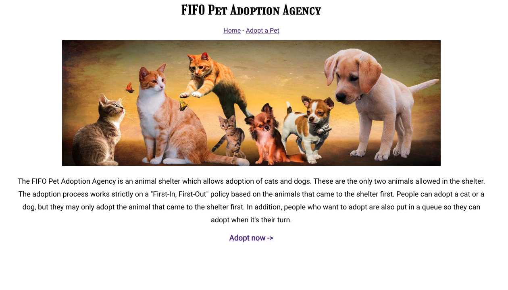
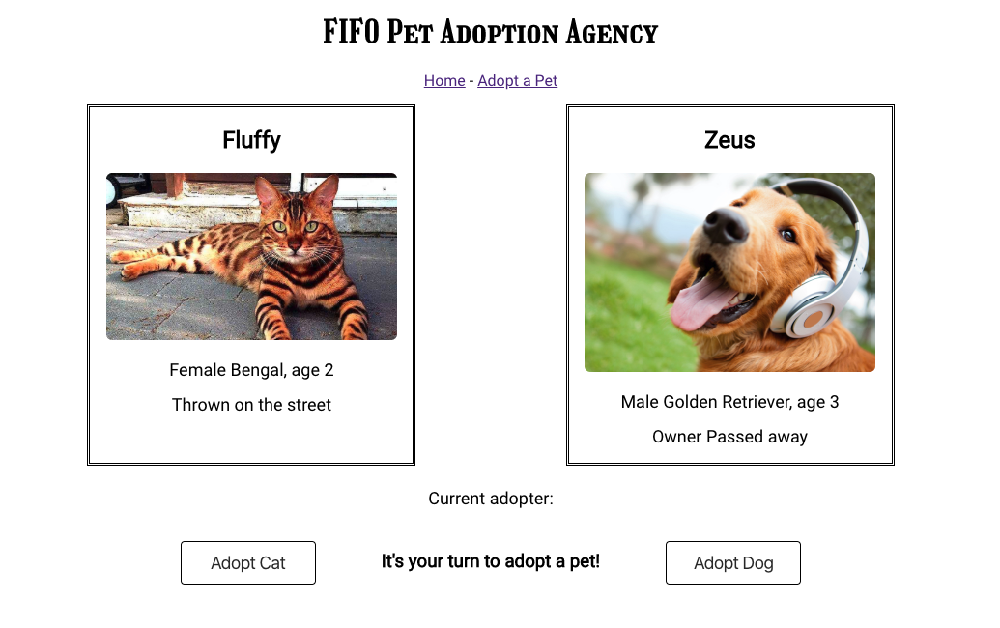

# Petful 
Created by: Maria Danielson and Zacharia Lutz

## About
This app simulates the adoption of cats and dogs. These are the only two animals allowed in the shelter. The app works strictly on a "First-In, First-Out" basis according to the animals that came to the shelter first. People can adopt a cat or a dog, but they may only adopt the animal that came to the shelter first. In addition, people who want to adopt are also put in a queue so they can adopt when it's their turn.

## Live Application
[Petful live page](https://zac-maria-petful.now.sh)
[API] (https://zac-maria-petful.herokuapp.com/api)

### API Usa
- GET /api/users returns the queue of adopters
- GET /api/cat returns the cat currently up for adoption
- GET /api/dog returns the dog currently up for adoption

## Technoligies Used
Client side: HTML5, CSS3, JavaScript, React.js
Server side: JavaScript, Express.js, Node.js

## Links to code 
Client: [Client](https://github.com/thinkful-ei-heron/Zac-Maria_Petful_Client.git)
Server: [Server](https://github.com/thinkful-ei-heron/zac-maria-petful-server2.git)

## Screen Shots
### Home page 

### Adoption Page
